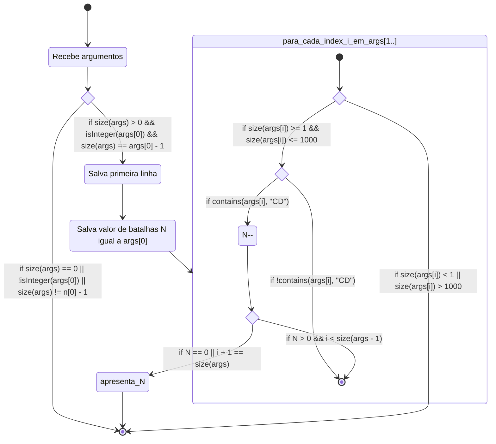

# plant-uml-gherkin-exercise

Diagram:

```mermaid
stateDiagram-v2

RB: Recebe argumentos
state valida_entrada <<choice>>
salva_primeira: Salva primeira linha
salva_numero_ganhos: Salva valor de batalhas N igual a args[0]
state main_loop: para cada linha subsequente.
state valida_N <<choice>>
state apresenta_N: apresenta valor de N

[*] --> RB
RB --> valida_entrada
valida_entrada --> salva_primeira: if size(args) > 0 && isInteger(args[0]) && size(args) == args[0] - 1
valida_entrada --> [*]: if size(args) == 0 || !isInteger(args[0]) || size(args) != n[0] - 1
salva_primeira --> salva_numero_ganhos 
salva_numero_ganhos --> para_cada_index_i_em_args[1..]

state para_cada_index_i_em_args[1..] {
    state valida_golpes <<choice>>
    state valida_caracteres <<choice>>
    decrem: N--
    [*] --> valida_golpes 
    valida_golpes --> valida_caracteres: if size(args[i]) >= 1 && size(args[i]) <= 1000
    valida_caracteres --> decrem: if contains(args[i], "CD")
    valida_caracteres --> [*]: if !contains(args[i], "CD")
    decrem --> valida_N
    valida_N --> [*]: if N > 0 && i < size(args - 1)
}
valida_N --> apresenta_N: if N == 0 || i + 1 == size(args)
apresenta_N --> [*]
valida_golpes --> [*]: if size(args[i]) < 1 || size(args[i]) > 1000

```